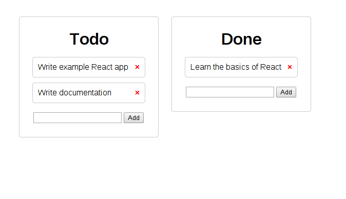
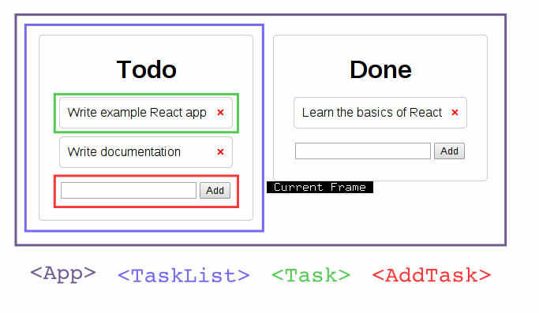

# Kanban



This example is basically a [Trello][trello] clone: We have a set of lists of
tasks ("Todo", "Done"), and each holds some tasks. We can add tasks, delete
them, or drag them from one list to the other. We'll [React DnD][dnd] for
drag-and-drop and a simple Python server for persistence.

## The Server

We'll be using [Flask][flask] for the server, since we don't need much. First,
the imports and the app definition:

```python
import json

from flask import Flask, request
app = Flask(__name__, static_url_path='', static_folder='.')
```

Now, some barebones models:

```python
class Task(object):
    """A task."""

    def __init__(self, text):
        self.text = text

    def to_dict(self):
        return {"text": self.text}


class TaskList(object):
    """A list of Task objects."""

    def __init__(self, name, tasks):
        self.name = name
        self.tasks = tasks

    def to_dict(self):
        return {
            "name": self.name,
            "tasks": [task.to_dict() for task in self.tasks]
        }


class Board(object):
    """A collection of TaskLists."""

    def __init__(self, lists):
        self.lists = lists

    def to_dict(self):
        return {
            "lists": [list.to_dict() for list in self.lists]
        }
```

For persistence, we'll just use the memory:

```python
DB = Board([
    TaskList(name="Todo",
             tasks=[
                 Task("Write example React app"),
                 Task("Write documentation")
             ]),
    TaskList(name="Done",
             tasks=[
                 Task("Learn the basics of React")
             ])
])
```

### Routes

And now, the routes. This is just a simple REST API that uses JSON, handles
actions and even some errors.

First, we need a route that will be called on application startup, to get the
initial (or current) state of the Kanban board:

```python
@app.route("/api/board/")
def get_board():
    """Return the state of the board."""
    return json.dumps(DB.to_dict())
```

We also need a way to add new tasks to a list, which is what `add_task` does.

```python
@app.route("/api/<int:list_id>/task", methods=["PUT"])
def add_task(list_id):
    # Add a task to a list.
    try:
        DB.lists[list_id].tasks.append(Task(text=request.form.get("text")))
    except IndexError:
        return json.dumps({"status": "FAIL"})
    return json.dumps({"status": "OK"})
```

And a way to delete tasks:

```python
@app.route("/api/<int:list_id>/task/<int:task_id>", methods=["DELETE"])
def delete_task(list_id, task_id):
    # Remove a task from a list.
    try:
        del DB.lists[list_id].tasks[task_id]
    except IndexError:
        return json.dumps({"status": "FAIL"})
    return json.dumps({"status": "OK"})
```

Finally, we use the root route to serve the `index.html` file:

```python
@app.route("/")
def index():
    return app.send_static_file('index.html')
```

And now we tell Flask to always run the server on port 8000:

```python
if __name__ == "__main__":
    app.run(port=8000, debug=True)
```

## The Client



First, let's import the `DragDropMixin`:

```js
var DragDropMixin = ReactDND.DragDropMixin;
```

Since we're only moving one type of component, tasks, we declare that:

```js
const ItemTypes = {
  TASK: 'task'
};
```

First, we define the `Task` component. Since we're going to be dragging it from
task list to task list, we use the `DragDropMixin`.

We then implement the `beginDrag` function and register it with React
DnD. Whenever a task is dragged, we carry the task's text and deletion callback
along with it.

```js
var Task = React.createClass({
  mixins: [DragDropMixin],

  statics: {
    configureDragDrop: function(register) {
      register(ItemTypes.TASK, {
        dragSource: {
          beginDrag: function(component) {
            return {
              item: {
                text: component.props.text,
                deleteTask: component.props.deleteTask
              }
            };
          }
        }
      });
    }
  },

  render: function() {
    return (
      <li className="task"
          {...this.dragSourceFor(ItemTypes.TASK)}>
        {this.props.text}
        <span className="delete"
              onClick={this.props.deleteTask} />
      </li>
    );
  }
});
```

Then we implement `AddTask`, a sub component of `TaskList` for adding new tasks
to the task list:

```js
var AddTask = React.createClass({
  getInitialState: function() {
    return { text: "" };
  },

  handleChange: function(event) {
    this.setState({text: event.target.value});
  },

  render: function() {
    return (
      <div className="add-task">
        <input type="text"
               value={this.state.text}
               onChange={this.handleChange} />
        <button type="button" onClick={this.props.addTask.bind(null, this.state.text)}>
          Add
        </button>
      </div>
    );
  }
});
```

The `TaskDropBin` is the component in a `TaskList` where tasks being dragged can
be dropped into.

The `acceptDrop` function takes a component (The drop bin itself) and an item,
which is a JavaScript object representing the data being dragged. We call the
item's `deleteTask` method, which removes it from its original list, and call
the `addTask` method of the drop bin's parent task list to add the task to the
list.

```js
var TaskDropBin = React.createClass({
  mixins: [DragDropMixin],

  statics: {
    configureDragDrop: function(register) {
      register(ItemTypes.TASK, {
        dropTarget: {
          acceptDrop: function(component, item) {
            // When a task is dropped, add it to the parent task list
            item.deleteTask();
            component.props.list.addTask(item.text);
          }
        }
      });
    }
  },
```

We query the component's drop state and set its class name accordingly. We'll
later use this to decide whether to show or hide it, and change its color to let
the user know when they can drop a component into the bin.

```js
  render: function() {
    const dropState = this.getDropState(ItemTypes.TASK);

    var stateClass = 'none';
    if (dropState.isHovering) {
      stateClass = 'hovering';
    } else if (dropState.isDragging) {
      stateClass = 'dragging';
    }

    return <div className={"drop drop-state-" + stateClass}
                {...this.dropTargetFor(ItemTypes.TASK)}>
      Drop here
    </div>;
  }
});
```

Finally, the task list itself. Since it holds a list of tasks which can be
deleted, and to which new ones can be added, we make that a big of state:

```js
var TaskList = React.createClass({
  getInitialState: function() {
    return { tasks: this.props.tasks };
  },
```

The `deleteTask` and `addTask` methods send requests to the server to carry out
the operations in the backend so data remains consistent.

```js
  deleteTask: function(id) {
    var self = this;
    $.ajax({
      url: '/api/' + this.props.id + '/task/' + id,
      type: 'DELETE',
      success: function(result) {
        var tasks = self.state.tasks;
        tasks.splice(id, 1);
        self.setState({ tasks: tasks });
      }
    });
  },

  addTask: function(text) {
    var self = this;
    $.ajax({
      url: '/api/' + this.props.id + '/task',
      type: 'PUT',
      data: { 'text' : text },
      success: function(result) {
        self.setState({ tasks: self.state.tasks.concat([{ text: text }]) });
      }
    });
  },
```

Now we have the render function, which builds up the list of `Task` components
along with other things, like the list's title, its task drop bin and `AddTask`
component.

```js
  render: function() {
    var self = this;
    var task_list = this.state.tasks.map(function(task, index) {
      return (
        <Task key={index}
              text={task.text}
              deleteTask={self.deleteTask.bind(self, index)} />
      );
    });
    return (
      <div className="task-list">
        <h1 className="list-title">
          {this.props.name}
        </h1>
        <ul className="list-tasks">
          {task_list}
        </ul>
        <TaskDropBin list={this} />
        <AddTask addTask={self.addTask} />
      </div>
    );
  }
});
```

Finally, the app component. This is just a wrapper around the other components
that wraps `TaskList` components in a `div`.

```js
var App = React.createClass({
  render: function() {
    var lists = this.props.lists.map(function(list, index) {
      return (
        <TaskList key={index}
                  id={index}
                  name={list.name}
                  tasks={list.tasks} />
      );
    });
    return (
      <div className="lists">
        {lists}
      </div>
    );
 }
});
```

Once the document has loaded, we ask the server for the initial state of the
board, and render that using the `App` component:

```js
$(document).ready(function() {
  $.getJSON('http://localhost:8000/api/board', function(data) {
    React.render(
      <App lists={data.lists} />,
      document.body
    );
  });
});
```

## Style

And finally, we add some style. First, general `body` style:

```css
@charset "utf-8";

body {
    margin: 0;
    font-family: "Helvetica Neue", Helvetica, Arial, sans-serif;
}
```

Next, we style the task lists:

```css
.lists {
    padding: 50px;
}

.task-list {
    width: 220px;
    float: left;
    margin-right: 25px;
    padding: 25px;
    border: 1px solid #ccc;
    border-radius: 5px;
}

.list-title {
    margin: 0;
    text-align: center;
}

.list-tasks {
    padding: 0;
}
```

The task list's drop bin is just a big rectangle with the text "Drop here",
which is not very complicated to style:

```css
.drop {
    width: 100%;
    text-align: center;
    font-weight: bold;
    padding: 15px 0;
}
```

Since we change the class of the task list's drop bin depending on its state, we
use this state to style it. When the state is `none`, we hide it, on the two
other states, we change the color: Orange when a task is being dragged around,
and green when it is hovering over a drop bin.

```css
.drop-state-none {
    display: none;
}

.drop-state-dragging {
    background-color: #E98B39;
}

.drop-state-hovering {
    background-color: #2ECC71;
}
```

Finally, some style for the individual tasks:

```css
.task {
    list-style-type: none;
    border: 1px solid #ccc;
    border-radius: 5px;
    padding: 10px;
    margin-bottom: 10px;
}
```

And we use the CSS [content property][content-prop] to put a Unicode times
symbol and make a neat little delete button:

```css
.delete:before {
    content: "×";
}

.delete {
    color: red;
    float: right;
    font-weight: bold;
}
```

[flask]: http://flask.pocoo.org/
[trello]: https://trello.com/
[dnd]: https://github.com/gaearon/react-dnd
[content-prop]: https://developer.mozilla.org/en-US/docs/Web/CSS/content
