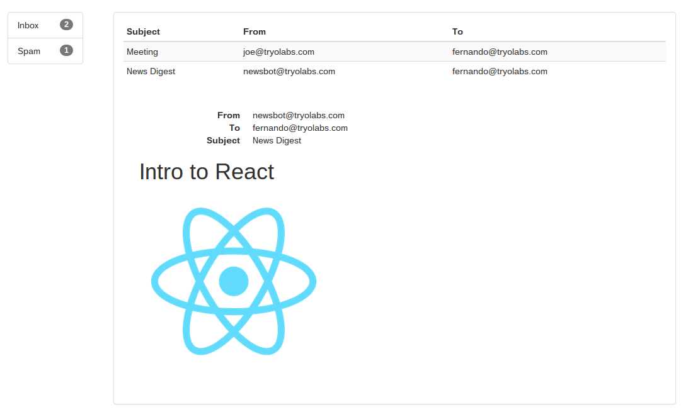
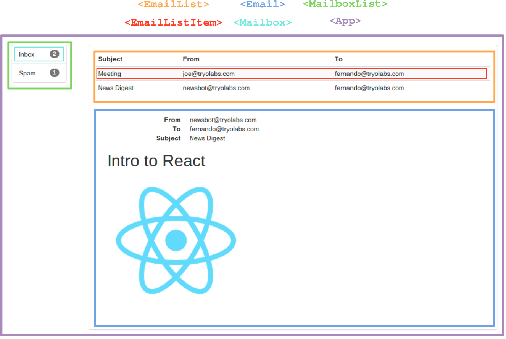

# Mailbox



The app we want to design is basically a React clone of the email client in
Ember's home page. It won't send email, or communicate with a backend to pull a
list of emails, it's just a bit of static data with some Bootstrap styling.

## Components

Each component is, as always, a visible, semantic element on the screen. We have
components to represent an email, a list of emails, the list of mailboxes, and a
general component for when no email or mailbox has been selected. I’ve
highlighted component structure, as the React examples do, in this image:



The interface is precisely what you’d expect. There’s a list of mailboxes
(Inbox, Spam), when you click on one it updates the list of emails, and when you
click on an email from the list it displays its metadata and body.

First things first: The `Email` component.

```javascript
var Email = React.createClass({
  render: function() {
    return (
      <div className="email">
        <dl className="meta dl-horizontal">
          <dt>From</dt>
          <dd>{this.props.from}</dd>

          <dt>To</dt>
          <dd>{this.props.to}</dd>

          <dt>Subject</dt>
          <dd>{this.props.subject}</dd>
        </dl>
        <div className="body" dangerouslySetInnerHTML={{__html: this.props.body}}></div>
      </div>
    );
  }
});
```

This is just a `div` with a definition list of the various props, nothing that
requires an explanation. We embed the raw HTML body using React's
`dangerouslySetInnerHTML`. Note that this is just an example, you probably
should never use `dangerouslySetInnerHTML` in "real" code as it is, well,
dangerous. You can read more about that
[here](https://facebook.github.io/react/tips/dangerously-set-inner-html.html).

Now, the list of emails. Which is actually rendered as a table, but semantically
is a list. Let's first go through the list itself:

```javascript
var EmailList = React.createClass({
  render: function() {
    var email_list = this.props.emails.map(function(mail) {
      return (
        <EmailListItem key={mail.id}
                       from={mail.from}
                       to={mail.to}
                       subject={mail.subject}
                       on_click={this.props.onSelectEmail.bind(null, mail.id)} />
      );
    }.bind(this));

    return (
      <table className="email-list table table-striped table-condensed">
        <thead>
          <tr>
            <th>Subject</th>
            <th>From</th>
            <th>To</th>
          </tr>
        </thead>
        <tbody>
          {email_list}
        </tbody>
      </table>
    );
  }
});
```

The render function iterates over the email list, collecting (Or it 'maps over')
`<EmailListItem>` components, passing some initial props to them. There are two
props here that matter:

* `key`: This is a prop that you pass to every list item when building lists in
  react. It can simply be the index (Which the `map` function provides), or a
  more domain-specific identifier.

* `on_click`: This prop sends a function that's passed from even higher up down
  to the `<EmailListItem>`. We use `bind` to partially apply the function.

Now, the `<EmailListItem>` component looks like this:

```javascript
var EmailListItem = React.createClass({
  render: function() {
    return (
      <tr onClick={this.props.on_click.bind(null)}>
        <td>{this.props.subject}</td>
        <td>{this.props.from}</td>
        <td>{this.props.to}</td>
      </tr>
    );
  }
});
```

Here we use React's `onClick` prop to declare that when that table row is
clicked, the `on_click` prop should be called.

Here we take a slight detour to make a small, reusable component. We use this
whenever we let the user choose an element from a list, to represent the initial
state when no element is chosen. The `<NoneSelected>` component uses a single
prop, `text`.

```javascript
var NoneSelected = React.createClass({
  render: function() {
    return (
      <div className="none-selected alert alert-warning" role="alert">
        <span>No {this.props.text} selected.</span>
      </div>
    );
  }
});
```

Now, we build a Mailbox component we can use to display the current email and
the list of emails. The `<Mailbox>` has only one item of state: The ID of the
selected email, which is either a natural number or null. A method,
`handleSelectEmail`, will be passed down the component hierarchy as a callback
for the `onClick` event of an `<EmailListItem>` instance.

The `render` functions is very simple: If an email is selected, it filters its
data out of the props and instantiates a corresponding `<Email>` component. If
it isn't, the "email" is just an instance of `<NoneSelected>`. Then the email
list and selected email are displayed.

```javascript
var Mailbox = React.createClass({
  getInitialState: function(){
    return { email_id: null };
  },

  handleSelectEmail: function(id) {
    this.setState({ email_id: id });
  },

  render: function() {
    var email_id = this.state.email_id;
    if (email_id) {
      var mail = this.props.emails.filter(function(mail) {
        return mail.id == email_id;
      })[0];
      selected_email = <Email id={mail.id}
                              from={mail.from}
                              to={mail.to}
                              subject={mail.subject}
                              body={mail.body} />;
    } else {
      selected_email = <NoneSelected text="email" />;
    }

    return (
      <div>
        <EmailList emails={this.props.emails}
                   onSelectEmail={this.handleSelectEmail} />
        <div className="email-viewer">
          {selected_email}
        </div>
      </div>
    );
  }
});
```

And now the list of mailboxes. This isn't too complicated, the `render` function
just maps over its props to create an array of list items, which it embeds in
the JSX.

```javascript
var MailboxList = React.createClass({
  render: function() {
    var mailbox_list = this.props.mailboxes.map(function(mailbox) {
      return (
        <li className="list-group-item"
            key={mailbox.id}
            onClick={this.props.onSelectMailbox.bind(null, mailbox.id)}>
          <span className="badge">
            {mailbox.emails.length}
          </span>
          {mailbox.name}
        </li>
      );
    }.bind(this));

    return (
      <div className="col-md-2">
        <ul className="mailboxes list-group">
          {mailbox_list}
        </ul>
      </div>
    );
  }
});
```

The `<App>` component ties everything together. Like the `<Mailbox>` component,
this has an ID (state) and a method to track the currently selected mailbox. The
`render` function is essentially the same as well: It renders a `<Mailbox>`
list, and if a mailbox is selected, it renders it, otherwise it renders a
`<NoneSelected>`.

```javascript
var App = React.createClass({
  getInitialState: function(){
    return { mailbox_id: null };
  },

  handleSelectMailbox: function(id) {
    this.setState({ mailbox_id: id });
  },

  render: function() {
    var mailbox_id = this.state.mailbox_id;
    if (mailbox_id) {
      var mailbox = this.props.mailboxes.filter(function(mailbox) {
        return mailbox.id == mailbox_id;
      })[0];
      selected_mailbox = <Mailbox key={mailbox.id}
                                  emails={mailbox.emails} />;
    } else {
      selected_mailbox = <NoneSelected text="mailbox" />;
    }

    return (
      <div className="app row">
        <MailboxList mailboxes={this.props.mailboxes}
                     onSelectMailbox={this.handleSelectMailbox} />
        <div className="mailbox col-md-10">
          <div className="panel panel-default">
            <div className="panel-body">
              {selected_mailbox}
            </div>
          </div>
        </div>
      </div>
    );
  }
});
```

We'll use the following fixtures for our mailboxes and emails:

```javascript
var fixtures = [
  {
    id: 1,
    name: "Inbox",
    emails: [
      {
        id: 1,
        from: "joe@tryolabs.com",
        to: "fernando@tryolabs.com",
        subject: "Meeting",
        body: "hi"
      },
      {
        id: 2,
        from: "newsbot@tryolabs.com",
        to: "fernando@tryolabs.com",
        subject: "News Digest",
        body: "<h1>Intro to React</h1> "
      }
    ]
  },
  {
    id: 2,
    name: "Spam",
    emails: [
      {
        id: 3,
        from: "nigerian.prince@gmail.com",
        to: "fernando@tryolabs.com",
        subject: "Obivous 419 scam",
        body: "You've won the prize!!!1!1!!!"
      }
    ]
  }
];
```

We render the app into the document's body, using the fixtures as the list of mailboxes.

```javascript
React.render(
  <App mailboxes={fixtures} />,
  document.body
);
```

Finally, we add a little style:

```css
.mailboxes {
    margin: 25px auto;
    width: 120px;
}

.mailbox {
    margin-top: 25px;
}

.email-viewer {
    padding: 25px;
}

.none-selected {
    margin: 20px;
    padding: 20px;
    font-size: 1.2em;
}
```

And that’s it. That’s the simplest react application with some actions and more
than a couple components. You can run this using the `run_server.sh` script in
this repository.

## A closer look at callbacks

Callbacks are passed down through the component hierarchy by props, and actions
climb their way back up to the component that handles them. For instance, when
selecting mailboxes:

1. The `<App>` component has a method, `handleSelectMailbox`, which takes a
   mailbox ID and sets the app's current mailbox ID to it.
2. In `render`, the method is passed to `<MailboxList>` as the `onSelectMailbox`
   prop.
3. In `<MailboxList>`, it's bound to null and assigned to the `onClick` event
   prop of the mailbox list item.

The repetition (Passing things again and again) rather violates DRY, but it's
not hard to follow after an initial look through the code.
